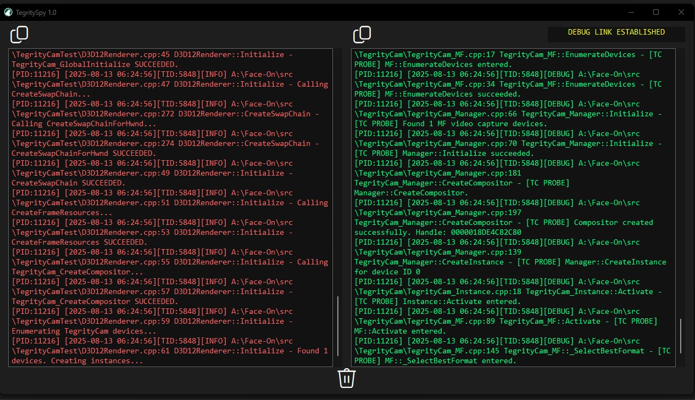

<p align="center">
  
</p>

<h1 align="center">TegritySpy</h1>

<p align="center">
  Standalone, dark-mode <code>OutputDebugString</code> monitor for Windows 10/11 with split-pane channel filtering, clipboard export, and DBWIN capture.
</p>

<p align="center">
  <a href="https://github.com/barc0d3/TegritySpy/releases/tag/TegritySpy">
    
  </a>
  <a href="https://github.com/barc0d3/TegritySpy/releases">
    
  </a>
  <a href="LICENSE">
    
  </a>
  
</p>

<p align="center">
  <a href="https://github.com/barc0d3/TegritySpy/releases/tag/TegritySpy">
    
  </a>
</p>


# Summary

TegritySpy is a standalone Windows 10/11 utility for monitoring the global OutputDebugString stream.  
It captures messages from any process via the `DBWIN_BUFFER` mechanism and displays them in a clean,  
dark-mode, split-pane interface for real-time analysis.

## Features

- **System-wide capture** — Reads the shared `DBWIN_BUFFER` without attaching a debugger.
- **Split channels** — Automatically routes tagged messages (e.g. `[TC PROBE]`) to a separate pane.
- **Dark mode UI** — Immersive dark theme with Fluent icon buttons.
- **Clipboard integration** — One-click copy of all output from a pane.
- **Clear controls** — Wipe both panes instantly.
- **Threaded listener** — Runs independently of the UI thread for smooth rendering.
- **Portable** — Single EXE, no dependencies beyond the Windows API.

## Use Cases

- Debugging multi-process systems without attaching Visual Studio.
- Monitoring engine logs, driver debug output, or custom probes in real time.
- Reverse-engineering or QA testing where log visibility is critical.

## Private Link Communication & Nexus Ping
TegritySpy can operate as a paired debug console for your own software, not just a passive log viewer.

When paired with a cooperating application, it can receive private control or status messages over the OutputDebugString channel using a simple tag-based protocol.

One key feature: Nexus Ping

Your app sends a ping tagged WM_APP_NEXUS_PING to confirm an active link.

TegritySpy reacts instantly:

Sets an internal g_nexusConnected flag.

Updates the UI with DEBUG LINK ESTABLISHED in yellow.

Optionally clears the status if no pings arrive within a timeout.

Example (paired application):
(<code>```
cpp
Copy
Edit
// Ping TegritySpy to show "DEBUG LINK ESTABLISHED"
OutputDebugStringW(L"[TC PROBE] NEXUS_PING\n"); ```</Code>)
Why it matters

Confirms TegritySpy is receiving from your intended process, not just globally.

Works as a heartbeat for scripts, connection monitoring, or handshakes.

Cuts through noisy logs by separating control traffic from normal debug output.

Turns TegritySpy into a real paired-operator console for your tools.

## Building

TegritySpy is pure Win32 C++.

1. Open the solution in Visual Studio 2019 or later.
2. Build as a standard Windows desktop application (Unicode, x64 or x86).
3. The resulting `TegritySpy.exe` is portable — no installer required.

### Requirements

- Windows 10 or 11 (dark mode enabled for immersive appearance).
- Visual Studio with Desktop Development for C++ workload.

## Usage

1. Launch TegritySpy.
2. Start any application that emits OutputDebugString calls.
3. Watch logs appear in the left (debug) or right (probe) pane.
4. Use the copy buttons to export logs, or the clear button to reset.

Messages are routed to the **probe** pane if they contain `[TC PROBE]` or `[Listener]` by default.

## License

MIT License — see below.

---

## MIT License
MIT License

Copyright (c) 2025 [Your Name]

Permission is hereby granted, free of charge, to any person obtaining a copy
of this software and associated documentation files (the "Software"), to deal
in the Software without restriction, including without limitation the rights
to use, copy, modify, merge, publish, distribute, sublicense, and/or sell
copies of the Software, and to permit persons to whom the Software is
furnished to do so, subject to the following conditions:

The above copyright notice and this permission notice shall be included in all
copies or substantial portions of the Software.

THE SOFTWARE IS PROVIDED "AS IS", WITHOUT WARRANTY OF ANY KIND, EXPRESS OR
IMPLIED, INCLUDING BUT NOT LIMITED TO THE WARRANTIES OF MERCHANTABILITY,
FITNESS FOR A PARTICULAR PURPOSE AND NONINFRINGEMENT. IN NO EVENT SHALL THE
AUTHORS OR COPYRIGHT HOLDERS BE LIABLE FOR ANY CLAIM, DAMAGES OR OTHER
LIABILITY, WHETHER IN AN ACTION OF CONTRACT, TORT OR OTHERWISE, ARISING FROM,
OUT OF OR IN CONNECTION WITH THE SOFTWARE OR THE USE OR OTHER DEALINGS IN THE
SOFTWARE.
